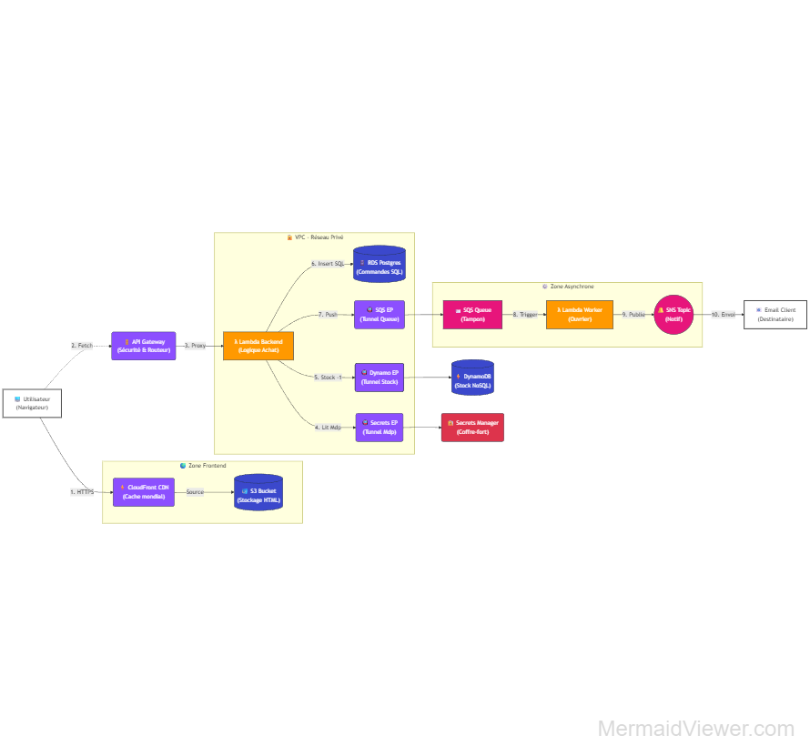

# 🎟️ AWS Serverless Event Platform

Une architecture cloud complète, résiliente et sécurisée pour une plateforme de billetterie à fort trafic.
Ce projet démontre l'utilisation d'une infrastructure **Event-Driven** sur AWS, gérée entièrement via **Infrastructure as Code (CDK Python)**.



## 🚀 Fonctionnalités Clés

* **Haute Disponibilité :** Distribution mondiale du frontend via CDN.
* **Gestion de Concurrence :** Système de réservation "Atomic Counter" pour empêcher la survente de billets.
* **Architecture Hybride :**
    * **NoSQL (DynamoDB)** pour la performance du catalogue et des stocks.
    * **SQL (RDS Postgres)** pour la fiabilité des transactions financières.
* **Traitement Asynchrone :** Utilisation de files d'attente (SQS) pour découpler l'achat de la notification (expérience utilisateur fluide).
* **Sécurité Maximale :** Backend isolé dans un VPC privé, aucun accès internet direct, gestion des secrets par rotation automatique.

---

## 🛠️ Stack Technique

| Composant | Service AWS | Rôle dans le projet |
| :--- | :--- | :--- |
| **IaC** | **AWS CDK (Python)** | Déploiement de toute l'infrastructure en code. |
| **Frontend** | **S3 + CloudFront** | Hébergement statique et mise en cache mondiale (HTTPS). |
| **API** | **API Gateway** | Point d'entrée REST sécurisé avec gestion CORS. |
| **Compute** | **Lambda (Python)** | Logique métier (Backend) et Workers asynchrones. |
| **Database 1** | **DynamoDB** | Stockage "Hot" : Catalogue concerts et décompte des places. |
| **Database 2** | **RDS (Postgres)** | Stockage "Cold" : Historique des commandes et paiements. |
| **Messaging** | **SQS + SNS** | File d'attente pour lisser la charge et système de notification Email. |
| **Security** | **VPC + Secrets Manager** | Réseau privé isolé et gestion cryptée des identifiants BDD. |

---

## 🏗️ Architecture Détaillée

Le projet suit un flux rigoureux :

1.  **Frontend :** L'utilisateur accède au site via CloudFront.
2.  **API :** Les requêtes d'achat sont validées par API Gateway.
3.  **Backend (VPC) :**
    * La Lambda vérifie le stock dans DynamoDB (décrémentation atomique).
    * Elle récupère les accès BDD via un tunnel privé vers Secrets Manager.
    * Elle enregistre la transaction dans Postgres.
    * Elle dépose un message dans la file d'attente SQS.
4.  **Worker (Async) :** Une seconde Lambda dépile les messages SQS et déclenche l'envoi d'email via SNS.

---

## ⚙️ Déploiement

### Prérequis
* Compte AWS actif
* AWS CLI configuré
* Node.js & Python installés
* AWS CDK installé (`npm install -g aws-cdk`)

### Installation

1.  **Cloner le dépôt :**
    ```bash
    git clone [https://github.com/informabook/aws-serverless-event-platform.git](https://github.com/informabook/aws-serverless-event-platform.git)
    cd aws-serverless-event-platform
    ```

2.  **Installer les dépendances Python :**
    ```bash
    pip install -r requirements.txt
    ```

3.  **Préparer le Layer SQL (Psycopg2) :**
    *Note : Nécessaire pour que Lambda puisse parler à Postgres.*
    ```bash
    pip install psycopg2-binary --platform manylinux2014_x86_64 --target=layers/python --implementation cp --python-version 3.9 --only-binary=:all: --upgrade
    ```

4.  **Déployer sur AWS :**
    ⚠️ Remplacez l'email par le vôtre pour recevoir les notifications.
    ```bash
    cdk deploy --context email=votre-email@exemple.com
    ```

5.  **Confirmation SNS :**
    Vous recevrez un email d'AWS. Cliquez sur le lien de confirmation pour activer les notifications.

---

## 🧪 Tests de Charge

Un script de stress-test est inclus (`stress_test.py`) pour simuler un trafic concurrentiel.

```bash
python stress_test.py